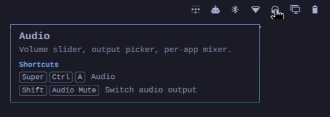

# What's This



Point at anything in Omarchy and learn what it is — and how to do it from the
keyboard. Switch it on from the bar (the **?** icon), then rest the pointer:

- **on a window** — the app's name and what it is (from its desktop entry,
  web apps included), the shortcut that opens it, and what you can do with
  the window: close, full screen, float, pop out, group, move to a workspace.
- **on a bar icon** — which widget it is and what it does (every Omarchy
  widget, each indicator icon, and third-party widgets via their manifest),
  plus its shortcuts: *Audio · Volume slider, output picker, per-app mixer ·
  Super Ctrl A*.
- **on empty desktop** — the workspace, and the shortcuts to get going from
  there: apps menu, terminal, browser, switching workspaces.

The card appears after the pointer rests for half a second, beside it, on the
monitor you're using, and disappears the moment you move. It never takes a
click.

**Shortcuts are read live** from Omarchy's own keybinding list
(`omarchy menu keybindings --print`), so your remaps and your own bindings in
`~/.config/hypr/bindings.lua` show up as you set them, and change when
Hyprland reloads its config.

## Coach

Right-click the **?** icon and switch on **Coach**. It watches for the
moments a shortcut would have done the job, and shows one small tip — then
stays quiet:

- **You click a workspace number on the bar** → *"Switch workspaces from the
  keyboard: Super 2 · Super 1…0 · Super Tab"*.
- **You open an app from the menu** → *"Open Ghostty in one keystroke:
  Super Return"* (only for apps that have a launch shortcut).

A tip retires once you've used its shortcut twice (switching workspaces with
the pointer away from the bar, or the app opening without the menu), is shown
at most three times, and tips are at least three minutes apart, eight a day at
most. "Forget what Coach has learned" in the same menu starts over.

**Coach never sees a keystroke.** It only listens to Hyprland's own event
socket (workspace changed, window opened, menu opened/closed) and asks where
the pointer is at that moment. No `input` group, no reading `/dev/input`, so
it works for everyone and can't see what you type. While only Coach is on it
uses no measurable CPU (0.00% over a 6-second sample): it wakes on events.

## Install

```bash
omarchy plugin add https://github.com/renardoberou/omarchy-plugin-whats-this --enable
```

Needs nothing beyond a standard Omarchy system (Hyprland, the `omarchy` CLI,
and the system `python3`, standard library only).

## Upgrading from Help

This plugin was called **Help** (`renardoberou.help`) until v0.3.0. Remove
the old one and add What's This; the on/off setting carries over:

```bash
omarchy plugin remove renardoberou.help
omarchy plugin add https://github.com/renardoberou/omarchy-plugin-whats-this --enable
```

## Remove

```bash
omarchy plugin remove renardoberou.whats-this
```

Its only state is in `~/.local/state/omarchy-whats-this/`: `active` (the
hover toggle) and `coach.json` (Coach's switch and what it has learned).

## Cost

Off: nothing runs. On: ~0.2–0.4% of one CPU core (measured with
[Plugin Tax](https://github.com/renardoberou/omarchy-plugin-tax) on a laptop).
The helper talks to Hyprland's IPC socket directly instead of starting
`hyprctl`, polls only the pointer position, and refreshes the window list only
after Hyprland announces a change. (v0.1 spent 13–18% of a core.)

## IPC

```bash
omarchy-shell renardoberou.whats-this toggle            # or: on / off
omarchy-shell renardoberou.whats-this status | jq
omarchy-shell renardoberou.whats-this inspectBar 1690 10  # what the card for that bar point says
omarchy-shell renardoberou.whats-this coachToggle       # or: coachOn / coachOff
omarchy-shell renardoberou.whats-this coachStatus | jq
omarchy-shell renardoberou.whats-this coachReset        # forget what Coach has learned
```

## How bar-icon help works

Plugins get no API that says which widget is under the pointer. This plugin's own
bar pill lives *inside* the bar, though, so while it is on it looks at the
widgets next to it — each Omarchy bar widget carries a `moduleName` and knows
its place on screen — and reports their rectangles, taking into account
parents that hide or clip them. Names and descriptions come from each
plugin's manifest (`omarchy-plugin-catalog`).

This relies on bar widgets keeping `moduleName`, which every Omarchy and
third-party bar widget has today. If a future Omarchy changes that, bar help
falls back to saying nothing rather than something wrong.

## Known limits

- It describes the *window* under the pointer, not individual buttons
  inside apps: Wayland apps don't expose their controls to other programs in
  a way that works reliably (v0.1 tried the accessibility bus; on this
  machine almost no app published anything).
- Shortcuts that apps define themselves (Ctrl+T in a browser) aren't known to
  Omarchy, so they aren't shown.
- A window's "Open" shortcuts come from Omarchy's launcher bindings; apps you
  launch some other way have none.

## Structure

```
manifest.json           service + bar-widget + overlay (keepLoaded)
Service.qml             toggle (persisted), daemon, bar rectangles, IPC
BarWidget.qml           bar toggle (?) and the bar-widget rectangle reporter
Overlay.qml             click-through tooltip card with key chips
Model.js                pure: key chips, bar hit-test, bar-widget cards, placement
bin/omarchy-whats-this  pointer dwell, Hyprland IPC, keybindings, app identity, cards
tests/                  node tests (Model.js), python tests (daemon)
```

## Local dev

```bash
omarchy plugin validate .
ln -sfn "$PWD" ~/.config/omarchy/plugins/renardoberou.whats-this
omarchy plugin enable renardoberou.whats-this
omarchy restart shell          # edits in a symlinked checkout need a restart
node --test tests/*.test.js
python3 -m unittest discover -s tests
```
